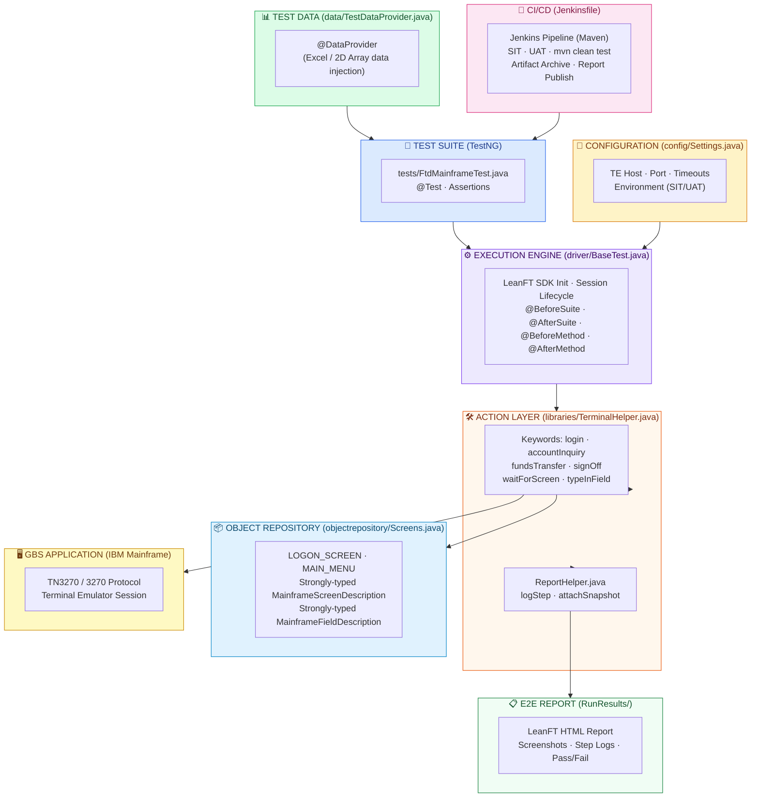

# boa-leanft-java-poc
# New Architecture – BOA Mainframe Automation (LeanFT Java)

> **Audience**: Engineering & QA Teams – details the layer structure of the LeanFT/Java framework for IBM Mainframe (TN3270) automation.

---

## Architecture Diagram



---

## Layer Descriptions

| Layer | File | Purpose |
|---|---|---|
| **Test Suite** | `tests/FtdMainframeTest.java` | Test cases utilizing TestNG `@Test` annotations and assertions. |
| **Execution Engine** | `driver/BaseTest.java` | Central execution controller — manages LeanFT SDK and TE session lifecycle via TestNG annotations. |
| **Configuration** | `config/Settings.java` | All environment-specific settings externalized (host, port, timeouts, env tag). |
| **Test Data** | `data/TestDataProvider.java` | Supplies isolated test data to the Test Suite using TestNG `@DataProvider`. |
| **Action Layer** | `libraries/TerminalHelper.java` | Reusable Java keyword functions for 3270 mainframe interactions. |
| **Report Helper** | `libraries/ReportHelper.java` | Wraps LeanFT Report SDK for structured step-level logging and snapshots. |
| **Object Repository** | `objectrepository/Screens.java` | Centralized, strongly-typed screen and field definitions using LeanFT SDK classes. |
| **E2E Report** | `RunResults/` | Generated LeanFT HTML report with screenshots, step logs, and pass/fail status. |
| **CI/CD** | `Jenkinsfile` | Declarative Maven pipeline with SIT/UAT environment params and report publishing. |

---

## Execution Flow

```text
Jenkins Pipeline (Jenkinsfile -> `mvn clean test`)
  └─► TestNG Test Suite (testng.xml)
        └─► BaseTest.setupSuite()            ← Init LeanFT SDK
        └─► BaseTest.setupTest()             ← Open TN3270 session
              └─► TestDataProvider           ← Inject data into @Test method
              └─► TerminalHelper.login()     ← Logon screen keyword
                    └─► waitForScreen()      ← Screen resolved from Screens.java
                    └─► typeInField()        ← Field position from Screens.java
                    └─► screen.sendKeys()
              └─► TerminalHelper.fundsTransfer()
                    └─► Executes steps via TE keywords
                    └─► Captures screenshot via ReportHelper
              └─► Assert.assertTrue()        ← TestNG assertion
              └─► ReportHelper.logStep()     ← Written to LeanFT HTML report
        └─► BaseTest.teardownTest()          ← Close TE session
        └─► BaseTest.teardownSuite()         ← LeanFT SDK cleanup
```

---

## Local Development Setup

### Prerequisites
1. **Java JDK 11** or higher.
2. **Apache Maven** installed and added to your system PATH.
3. **OpenText UFT Developer (LeanFT) Runtime Engine** installed and running locally on port 5095.

### Execution
To run the framework locally, execute the following Maven command from the project root:
```bash
mvn clean test -Denv=SIT
```
The execution reports will be automatically generated in the `RunResults/` directory.
